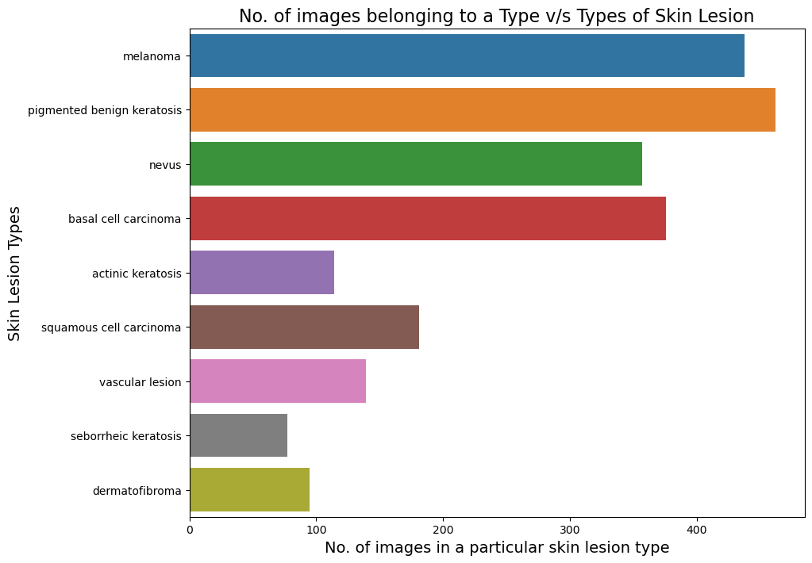
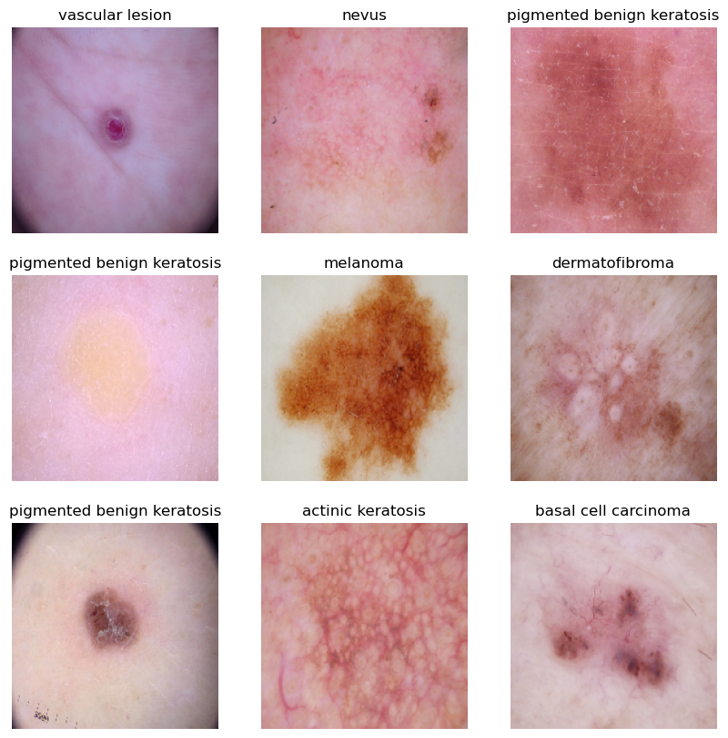
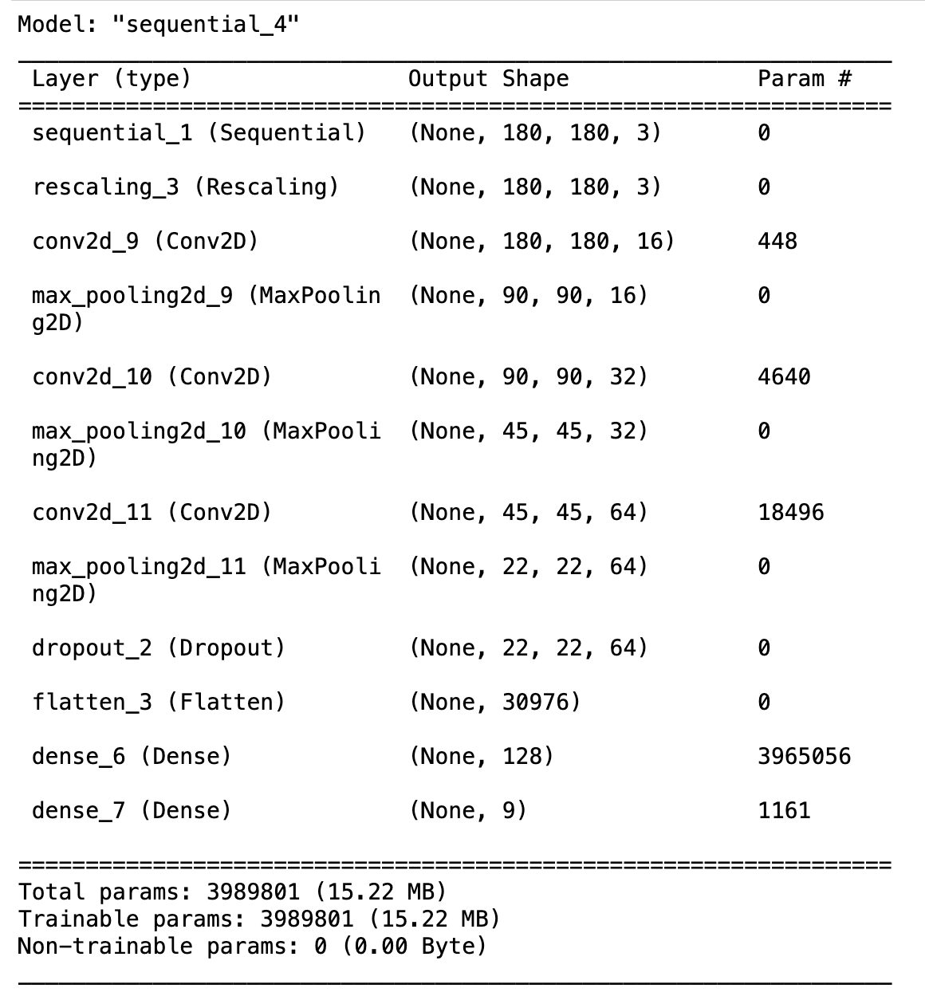
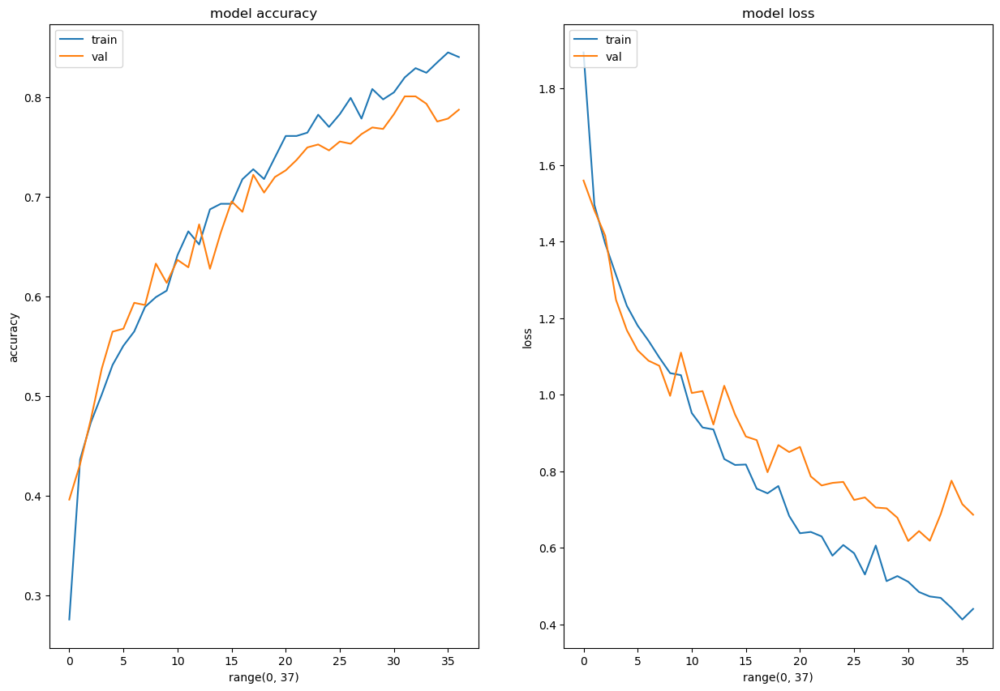

# Melanoma Skin Cancer Detection

## Abstract

Among the over 200 types of cancer, melanoma is the deadliest form of skin cancer. Its diagnosis typically begins with a clinical examination, followed by dermoscopic imaging and histopathological analysis. Early detection is crucial, as it significantly improves the likelihood of effective treatment. The first step in diagnosing melanoma involves visually inspecting the affected skin area. Dermatologists use high-speed cameras to capture dermatoscopic images of the lesions, with diagnostic accuracy ranging from 65% to 80% without additional technical assistance. By incorporating further visual evaluations by oncologists and dermatoscopic image analysis, the overall diagnostic accuracy can improve to 75% to 84%. The goal of this project is to create an automated classification system that uses image processing techniques to identify skin cancer based on images of skin lesions.

## Problem Statement

This project aims to develop a CNN-based model capable of accurately detecting melanoma. Melanoma is a type of skin cancer that can be fatal if not diagnosed early and accounts for 75% of skin cancer-related deaths. A solution that can analyze images and alert dermatologists about the presence of melanoma could significantly reduce the manual effort required for diagnosis.

## Table of Contents

- [General Information](#general-information)
- [Model Architecture](#model-architecture)
- [Model Summary](#model-summary)
- [Model Evaluation](#model-evaluation)
- [Technologies Used](#technologies-used)
- [Setup & Running](#setup--running)
- [Project Structure](#project-structure)
- [Acknowledgements](#acknowledgements)
- [Collaborators](#collaborators)

## General Information

The dataset includes 2,357 images showing both malignant and benign skin conditions, sourced from the International Skin Imaging Collaboration (ISIC). These images are categorized based on ISIC’s classification, ensuring an equal representation of each class.



To address the issue of class imbalance, the Augmentor Python package (https://augmentor.readthedocs.io/en/master/) was used to augment the dataset. This involved generating additional samples for all classes, ensuring balanced representation.

## Pictorial Representation of Skin Types



The objective is to classify each skin cancer image into the appropriate type.

## Model Architecture

A step-by-step breakdown of the final CNN architecture:

1. **Data Augmentation**: The `augmentation_data` variable defines the data augmentation techniques applied to the training data. These transformations include random operations like rotation, scaling, and flipping, which artificially increase the diversity of the dataset and help improve the model’s generalization ability.

2. **Normalization**: A `Rescaling(1./255)` layer is applied to normalize the pixel values of the input images, scaling them between 0 and 1. This normalization helps stabilize the training process and accelerates convergence.

3. **Convolutional Layers**: The model includes three convolutional layers, created using the `Conv2D` function. Each convolutional layer is followed by a ReLU activation function, adding non-linearity to the model. The `padding='same'` argument ensures that the spatial dimensions of the feature maps remain unchanged after convolution. The numbers (16, 32, 64) within each `Conv2D` layer correspond to the number of filters or kernels used in each layer, which affects the depth of the feature maps.

4. **Pooling Layers**: A max-pooling layer (`MaxPooling2D`) is added after each convolutional layer to downsample the feature maps. This reduces the spatial dimensions while preserving the most significant features. Max-pooling also helps reduce computational load and control overfitting.

5. **Dropout Layer**: A dropout layer (`Dropout`) with a dropout rate of 0.2 is included after the final max-pooling layer. Dropout is a regularization technique that helps prevent overfitting by randomly dropping a portion of the neurons during training.

6. **Flatten Layer**: The `Flatten` layer converts the 2D feature maps into a 1D vector, preparing the data for input into fully connected layers.

7. **Fully Connected Layers**: Two fully connected (dense) layers (`Dense`) are added with ReLU activations. The first dense layer has 128 neurons, while the second dense layer produces the final classification probabilities for each class.

8. **Output Layer**: The number of neurons in the output layer is determined by the `target_labels` variable, which specifies the number of classes in the classification task. The output layer has no activation function since it is followed by a loss function during training.

9. **Model Compilation**: The model is compiled using the Adam optimizer (`optimizer='adam'`) and the Sparse Categorical Crossentropy loss function (`loss=tf.keras.losses.SparseCategoricalCrossentropy(from_logits=True)`), suitable for multi-class classification. Accuracy is chosen as the evaluation metric (`metrics=['accuracy']`).

10. **Training**: The model is trained using the `fit` method with 50 epochs (`epochs=50`). Callbacks such as `ModelCheckpoint` and `EarlyStopping` are used to monitor validation accuracy. The `ModelCheckpoint` callback saves the best model based on validation accuracy, while the `EarlyStopping` callback stops training if the validation accuracy does not improve for a specified number of epochs (patience=5). These callbacks prevent overfitting and ensure the model converges optimally.

## Model Summary



## Model Evaluation



## Technologies Used

- [Python](https://www.python.org/) - version 3.11.4
- [Matplotlib](https://matplotlib.org/) - version 3.7.1
- [Numpy](https://numpy.org/) - version 1.24.3
- [Pandas](https://pandas.pydata.org/) - version 1.5.3
- [Seaborn](https://seaborn.pydata.org/) - version 0.12.2
- [TensorFlow](https://www.tensorflow.org/) - version 2.15.0
- [Augmentor](https://augmentor.readthedocs.io/en/master/) - dataset augmentation to correct class imbalance

## Setup & Running

Install dependencies:

```bash
pip install tensorflow==2.15.0 numpy==1.24.3 pandas==1.5.3 matplotlib==3.7.1 seaborn==0.12.2 Augmentor
```

Launch the notebook:

```bash
jupyter notebook shrey_jain_nn.ipynb
```

The notebook expects the ISIC skin-lesion image dataset (train/test folders of malignant/benign classes) to be available locally; update the dataset path at the top of the notebook to point at your local copy before running all cells.

## Project Structure

```
shrey_jain_nn.ipynb              Main CNN notebook (data prep, model, training, evaluation)
shrey_jain_cnn_assignmet.txt     Link back to this repo
static/images/                   Charts referenced in this README (class distribution, model summary/evaluation, skin cancer types)
```

## Acknowledgements

- UpGrad tutorials on Convolutional Neural Networks (CNNs)
- [Melanoma Skin Cancer](https://www.cancer.org/cancer/melanoma-skin-cancer/about/what-is-melanoma.html)
- [Introduction to CNN](https://www.analyticsvidhya.com/blog/2021/05/convolutional-neural-networks-cnn/)
- [Image Classification using CNN](https://www.analyticsvidhya.com/blog/2020/02/learn-image-classification-cnn-convolutional-neural-networks-3-datasets/)
- [Efficient CNN Architecture Building Guide](https://towardsdatascience.com/a-guide-to-an-efficient-way-to-build-neural-network-architectures-part-ii-hyper-parameter-42efca01e5d7)

## Collaborators

Created by [@er-shrey](https://github.com/er-shrey)